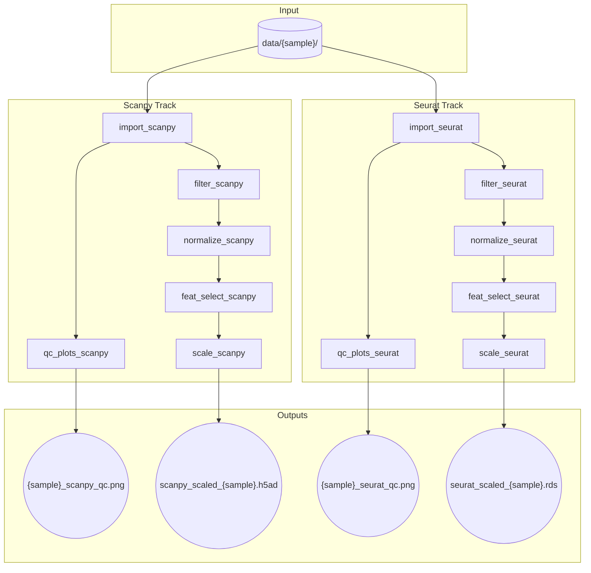

# sm-scrnaseq

Snakemake pipeline for scRNA-seq QC using Scanpy and Seurat.

## Pipeline DAG



## Usage

First run the qc_plots target rule, which will produce plots of the basic QC metrics in the plots/ directory. Determine the appropriate filtering thresholds and update the config file. Proceed to run the full pipeline.

```bash
# Generate QC plots
snakemake qc_plots --use-conda --cores 4

# Run full pipeline
snakemake --use-conda --cores 4
```
