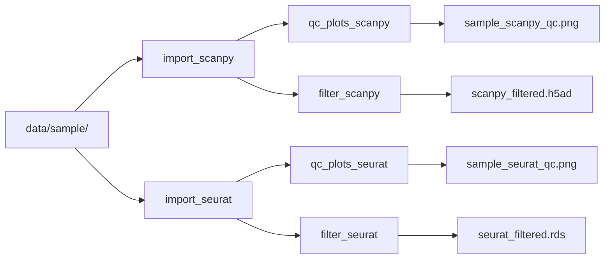

# sm-scrnaseq

Snakemake pipeline for scRNA-seq QC using Scanpy and Seurat.

## Pipeline DAG



## Usage

```bash
# Generate QC plots
snakemake qc_plots --use-conda --cores 4

# Run full pipeline (import + QC plots + filtering)
snakemake --use-conda --cores 4
```
